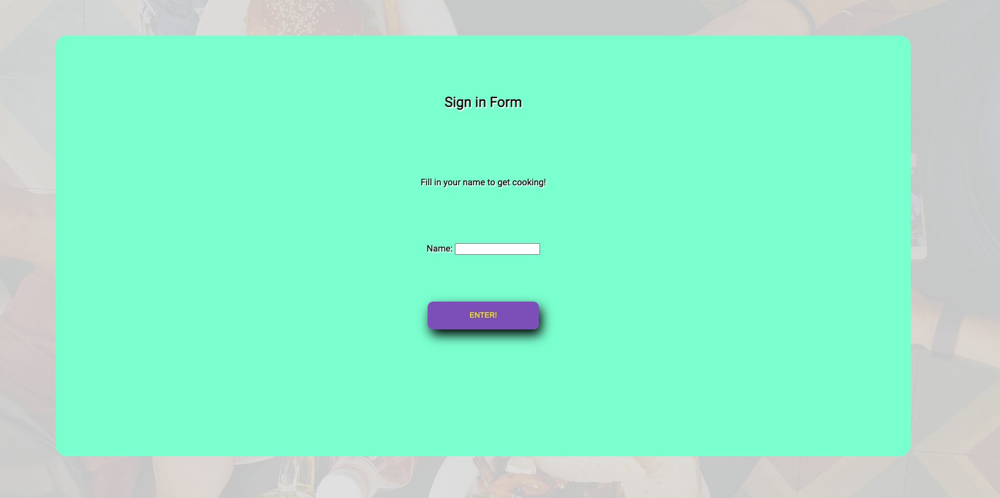

# What's for Dinner? 
## [try it here](https://pma913.github.io/whats-for-dinner/)

### Abstract:
[//]: <> (Briefly describe what you built and its features. What problem is the app solving? How does this application solve that problem?)

I built a random meal suggester. It has a stock of meals from three different courses, you can select which course you want and you will recieve a food to cook. This solves the problem of wanting to eat but can't make up your mind on what to eat. This app makes the decision of what to eat for you. I have also added a sign in page that takes your name and displays a welcome to make a little more personable.

### Installation Instructions:
[//]: <> (What steps does a person have to take to get your app cloned down and running?)

They would have to visit my repository, copy the ssh key, open their terminal, run git clone (ssh key) then cd into that directory and run open index.html.

### Preview of App:
[//]: <> (Provide ONE gif or screenshot of your application - choose the "coolest" piece of functionality to show off.)

### Context:
[//]: <> (Give some context for the project here. How long did you have to work on it? How far into the Turing program are you?)

I think I had to put roughly 10 - 15 hours into this project. The MVP was around 10 and then another 5 for DRY and extra styling. I am 3 weeks into Turing program.

### Contributors:
[//]: <> (Who worked on this application? Link to their GitHubs.)

[Patrick Ankiewica](https://www.linkedin.com/in/patrick-ankiewicz/)

### Learning Goals:
[//]: <> (What were the learning goals of this project? What tech did you work with?)

Gain experience building an application that utilizes HTML, CSS and JavaScript
Write HTML and CSS to match a provided comp
Understand how to listen to and respond to user events
Individualize your programming skill set

I worked with Javascript, CSS, HTML, devtools and VS code editor.

### Wins + Challenges:
[//]: <> (What are 2-3 wins you have from this project? What were some challenges you faced - and how did you get over them?)

First win was learning how to get a value from radio buttons. The radio buttons were a struggle from start to finish. Getting them to stack vertically on the page, getting them evenly spaced, getting them to work as one then getting the value. I think obtaining the value was the most difficult. The first night I was trying to get the values I had to stop and leave it for the next day. Luckily, one of my classmates put a link to a helpful article which made the distinction that I had to loop through the buttons like an array and find which one was checked then you can pull the value attribute from that specific element. 

The next win was compacting the function that printed a random food decided upon the radio button selected. I had it layed out in a multi layered if statement repeating almost identical code just inserting different values. After a little research I came across the eval function. After finding out the controversy around that function and a whole heap more research, I found that I could achieve the same result if I made an anonomous function using a provided string value then return that value and javascript will use that value to call the function it represents. 

The main and original challenges I faced were flex and how to use it. After personal research and the lessons provided, I had a much easier time organizing the visual content on my page.
